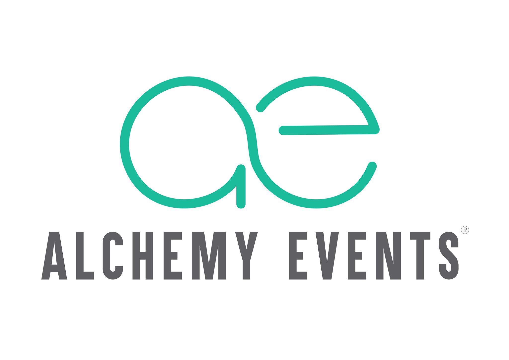

# Alchemy Events - Corporate Event Management Platform



## Overview

Alchemy Events is a modern, responsive web application designed for corporate event management. The platform specializes in MICE (Meetings, Incentives, Conferences, and Events) services, offering end-to-end solutions for corporate gatherings and celebrations.

## Features

###�� Core Functionalities
- **MICE Services Management**
  - Corporate Meetings
  - Incentive Programs
  - Conference Organization
  - Event Planning

### 💫 User Experience
- Responsive design for all devices
- Smooth animations using Framer Motion
- Interactive carousels and galleries
- Real-time form validation
- Mobile-optimized layouts

### 🛠 Technical Features
- Dynamic image loading with fallback support
- Firebase integration for contact form
- Client-side routing
- Optimized performance
- SEO-friendly structure

## Tech Stack

### Frontend
- React.js
- Tailwind CSS
- Framer Motion
- React Router DOM

### Backend & Services
- Firebase (Firestore)
- Firebase Authentication
- Cloud Functions

### Development Tools
- Vite
- PostCSS
- ESLint
- Prettier

## Getting Started

### Prerequisites
- Node.js (v14 or higher)
- npm or yarn
- Firebase account

### Installation

1. Clone the repository

```bash
git clone https://github.com/your-username/alchemy-events.git
cd alchemy-events
```

2. Install dependencies

```bash
npm install
# or
yarn install
```

3. Set up environment variables

```bash
cp .env.example .env
```
